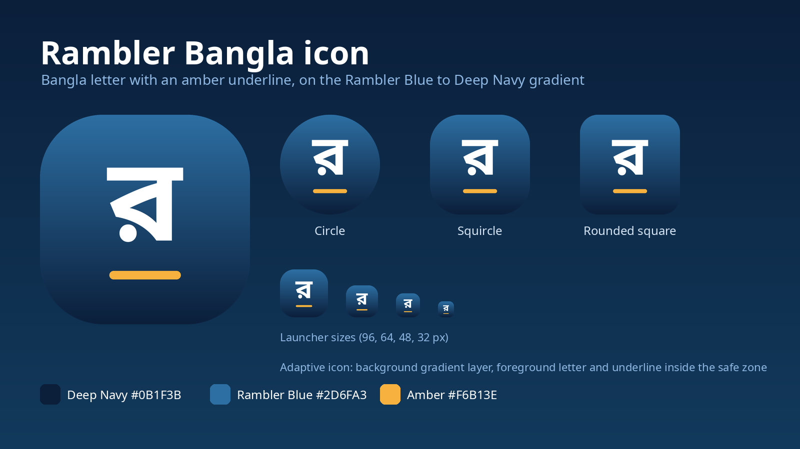
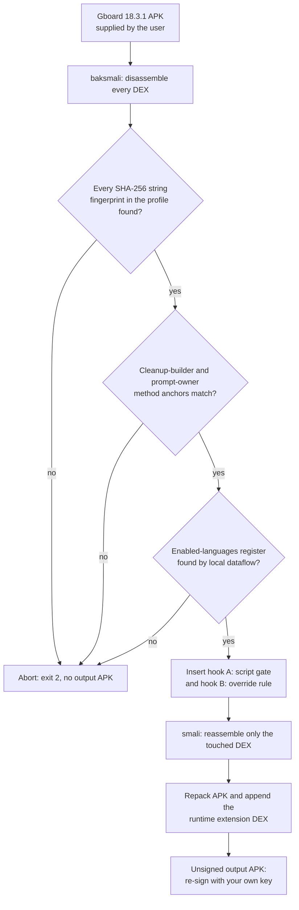

<p align="center"></p>

<p align="center">
<a href="https://muhib-karim.github.io/Rambler-Bangla/"><b>Website</b></a> ·
<a href="docs/V29.3-RELEASE-NOTES.md">Release notes</a> ·
<a href="CHANGELOG.md">Changelog</a> ·
<a href="docs/assets/3-icon-showcase.png">Icon</a> ·
<a href="SECURITY.md">Security</a>
</p>

<p align="center">
<a href="https://github.com/muhib-karim/Rambler-Bangla/actions/workflows/tests.yml"></a>


</p>

# Rambler Bangla

**Dictate in Bangla. Get Bangla.** Rambler Bangla is an open-source patch layer for Gboard 18.3.1 that keeps the voice cleanup stage from Romanizing Bengali, and handles mixed Bangla and English one sentence at a time.

<p align="center"></p>

> **Honest status.** This is a maintainer project with test builds. Host tests and a static CI suite back the claims below; the on-device results listed are from the maintainer's own phone. Anything marked "intended" is design, not proof. There is no public APK (see [Distribution](#distribution)).

## Highlights

| Feature | What you get | Evidence |
| --- | --- | --- |
| **Bangla stays Bangla** | Fail-closed patch keeps Bengali dictation in Bengali Unicode for `bn-BD`, `bn-IN` and `bn-Beng`, and English in Latin | 17 end-to-end checks and 51 policy assertions in CI on a synthetic fixture; Bangla-only and English-only layouts confirmed on a real device |
| **Bangla and English together** | One language per sentence on the multilingual layout (abc → বাংলা) | 292-case host corpus; confirmed on a real device with a few misses in quick mid-sentence switches |
| **Real Bangla spellings for English words** | কোম্পানি, টেলিভিশন, বার্লিন instead of letter-by-letter output. CMU-derived table plus reviewed overrides | Blind check 85 of 200 exact (historical), so expect misses |
| **Protected text** | #hashtags, @handles, links, emails and times stay in Latin letters | Checked in the V29.3 test corpus |
| **Settings you control** | Bangla script correction switch (on by default) and opt-in diagnostics (off by default) | Documented below |
| **Clipboard drag-to-reorder** | Long-press an item and drag it | Listed in V29.3 notes, in development |
| **Own package id** | Installs beside the stock keyboard; updates signed with the same key install in place | [`docs/SIDE-BY-SIDE.md`](docs/SIDE-BY-SIDE.md) |

## Icon and brand

<p align="center"><a href="docs/assets/3-icon-showcase.png"></a></p>

Colours: Deep Navy `#0B1F3B`, Rambler Blue `#2D6FA3`, Amber `#F6B13E`. The full reference sheet is [here](docs/assets/2-rb-brand-sheet.png). Text in the images is synthetic.

## Features

### Headline features (V29.3)

- **Multilingual voice typing, one language per sentence**: on the
  multilingual layout (abc → বাংলা), each dictated sentence is meant to come out
  in Bangla script or in English, not mixed. Maintainer test build; edge cases remain.
- **Real Bangla spellings for English words**: English words spoken inside
  Bangla are meant to come out as transliterations (কোম্পানি, টেলিভিশন, বার্লিন)
  instead of letter-by-letter output. Transliteration only, never
  translation.
- **Clipboard drag-to-reorder (in development)**: in the clipboard panel, long-press an item,
  drag it to a new spot, and drop it to change the order.
- **Protected text**: #hashtags, @handles, links, emails and times are meant to stay in
  Latin letters on the voice paths covered by the test corpus.

### How each layout is designed to behave

Design intent for the V29.3 test build; not re-verified on a current device.

| Layout | Voice and typing result |
| --- | --- |
| English (US) | English only. Rambler changes nothing. |
| বাংলা (native) | Bangla only. Romanized Bangla and English words become Bangla script. |
| abc → বাংলা | Multilingual. Each sentence is Bangla script or English, decided per sentence. |
| Bangla (Latin) | Treated as Bangla: output is Bangla script. |

Gboard's combined "EN · BN" keyboard reports itself as English (US), so it
behaves like the English row. For mixed Bangla and English dictation, use
the abc → বাংলা layout.

### Settings

Design intent, not re-verified on a current device. Both switches are in the keyboard's settings, in the Rambler section.

**Bangla script correction** (on by default)
- On: Rambler converts Romanized Bangla to Bangla script, applies the
  loanword spellings, and follows the per-layout rules above. This is what
  most users want.
- Off: Rambler converts nothing, for voice or typing. You get Gboard's own
  output unchanged, so Bangla speech may appear in Latin letters.
- When to turn it off: if you prefer Romanized Bangla, or to check whether an
  odd result comes from Rambler or from Gboard itself.

**Rambler diagnostics** (off by default)
- Use it only when reporting a problem. It is a privacy-sensitive feature and has not been re-audited for the current build.
- Turn it on, reproduce the problem (dictate or type the same text), then
  turn it off. Turning it off saves a log to your Downloads folder as
  `RamblerBangla-diag-<date>-<time>.txt` and shows "Rambler diag saved to
  Downloads".
- The log records the active layout and how each dictation or typed text was
  converted, including the text before and after conversion. It stays on your phone
  unless you share it. Read it before you share it, and leave diagnostics off
  in normal use.

### Under the hood

- **Script gate**: two runtime hooks replace the injected "Hinglish Override"
  rule and rewrite only the Romanization bullet of the cleanup prompt's
  SCRIPT GATE, driven by the enabled-language list. Fail-closed: any
  fingerprint, signature, or dataflow miss aborts with no output.
- **Segment-locked multilingual dictation (V28)**: each dictated segment is
  classified once and rendered entirely in one language.
- **Bangla spelling normalization (V29)**: garble-resistant English
  near-match demotion plus a 2,265-pair canonical roman-to-script table.
- **Loanword spelling table (V29.3)**: built from the CMU Pronouncing
  Dictionary (BSD) plus reviewed overrides. See `data/loanspell/`.
- **Side-by-side install**: the test build ships under its own package
  identity (`com.aidev2024.ramblerbangla`) and installs alongside the upstream
  keyboard.
  The repository contains the rename tooling and audit documentation, but no
  APK, generated DEX, key, or other proprietary binary. See `rename/` and
  `docs/SIDE-BY-SIDE.md`.
- **Source only**: this repository distributes no APKs.


## Maintainer builds, October 2026

Test builds 245 to 253 are private maintainer builds (see [Distribution](#distribution)). Each claim carries its evidence level.

| Item | Level |
| --- | --- |
| Updates signed with the same key install over the existing app, no uninstall | Confirmed on the maintainer's phone (build 253 over 251) |
| Gboard AI writing-tools (refinement) icon visible again on build 253 | Confirmed on the maintainer's phone. Cause of the return is not proven; 253 is a compatibility-only change |
| Build 253: compatibility update that retargets three stale internal ids and adds an observer, with no behaviour flags changed | Two independent static reviews passed; no runtime proof |
| Stray "123" labels suppressed on pinned and list items (display only) | Static review only. Unpinned path clean on the phone; the pinned fix is not phone-confirmed |
| Clipboard recents setting (default 5, range 5 to 10) and masking default off | Static review only |
| Multilingual clause segmentation, phonetic typing with an EN/BN toggle, Bangla (Latin) layout | Planned or in progress. Not working yet |

## Project status

See [`CHANGELOG.md`](CHANGELOG.md) for the full history. In short:

- **V29.3 (2026-09-24), tagged [v29.3](https://github.com/muhib-karim/Rambler-Bangla/releases/tag/v29.3):** one language per sentence in multilingual dictation, English loanword spelling in Bangla voice output. Notes: [`docs/V29.3-RELEASE-NOTES.md`](docs/V29.3-RELEASE-NOTES.md). Build record: [`ledger/v29.3-provenance.md`](ledger/v29.3-provenance.md).
- **V29 (2026-09-23):** field iteration. Design: [`docs/V29-DESIGN.md`](docs/V29-DESIGN.md), fixtures: [`docs/V29-FIXTURES.md`](docs/V29-FIXTURES.md).
- **v28d:** last stable baseline (historical). Evidence: [`docs/EVIDENCE.md`](docs/EVIDENCE.md), [`docs/V28-SEGMENT-LOCK.md`](docs/V28-SEGMENT-LOCK.md).

## Distribution

This repository is source only. A patched keyboard contains Google's proprietary Gboard code, which is not licensed for redistribution, so no APK is published here. You apply the patch to a Gboard 18.3.1 APK you obtain yourself and sign it with your own key. See [`docs/LICENSING-AUDIT.md`](docs/LICENSING-AUDIT.md).

## How it works

The patcher does not edit bytes by offset. It disassembles the APK, proves it
is looking at the exact build the profile describes, and only then inserts two
calls into one method. If a check fails, the patcher exits with status 2 and
writes no output file.



1. **Fingerprint sweep.** `fingerprints/gboard-18.3.1.json` lists SHA-256
   hashes of strings the target build must contain. The profile stores
   hashes, not the strings, so no Google text is reproduced here. One miss
   means an unrecognized build, and the patcher refuses it.
2. **Anchors.** The cleanup-builder method and the method that owns the
   cleanup prompt must exist with the exact class, name and signature in the
   profile.
3. **Dataflow.** Inside the cleanup builder, the patcher traces the
   placeholder string to its `String.replace` call to find the register that
   holds the enabled-languages value, instead of trusting a hard-coded
   register number.
4. **Hooks.** Two calls into `GboardRamblerLiteScriptRuntime` are inserted.
   At runtime, hook B replaces the injected "Hinglish Override" rule and hook
   A rewrites only the Romanization bullet of the prompt's SCRIPT GATE, based
   on the enabled languages. The original rule string stays in place as the
   fail-safe input.
5. **Repack.** Only the touched DEX is reassembled, and the runtime is added
   as an extra DEX. The patcher never signs.

Running the patcher on a build it has already patched is refused too, which
the test suite checks.

## Build and reproduce

```bash
bash scripts/bootstrap_tools.sh          # fetch pinned toolchain into ./tools
pip install androguard==4.1.4
source tools/tool-env.sh
bash tests/run_tests.sh                  # full suite: expect "17 passed, 0 failed"

# Against a real, user-supplied Gboard 18.3.1 APK:
python3 standalone-patcher/dex_patch.py analyze \
  --apk /path/to/gboard-18.3.1.apk --profile fingerprints/gboard-18.3.1.json
python3 standalone-patcher/dex_patch.py patch \
  --apk /path/to/gboard-18.3.1.apk --out /path/to/out.apk \
  --profile fingerprints/gboard-18.3.1.json --extension-dex <runtime.dex>
scripts/verify_apk.sh single /path/to/out.apk --profile fingerprints/gboard-18.3.1.json
scripts/verify_apk.sh compare /path/to/stock.apk /path/to/out.apk
```

The patcher never signs; re-sign with your own key afterwards (upstream
builds additionally rename the package and bypass signature checks). Building
`runtime.dex`: `javac` the extension class, then `d8 --min-api 24`
(`fixtures/build_fixture.sh` shows both steps).

## Verification

[`tests/run_tests.sh`](tests/run_tests.sh) runs in CI on every push to `main`
and on every pull request ([Static test suite](.github/workflows/tests.yml)).
It needs no phone and no Google binaries: it builds a synthetic fixture APK
that mirrors the real anchors, then patches it. The suite has five stages:

| Stage | What it asserts |
| --- | --- |
| 1. Policy unit tests | 51 JVM assertions on the runtime: locale classification, which override rule applies, and the SCRIPT GATE rewrite |
| 2. Fixture build | The fixture APK builds end to end with smali, d8, aapt2 and signing |
| 3. End-to-end patch | Anchors and fingerprints resolve; both hooks are inserted; the enabled-languages value lands in its own register; hook arguments don't clobber each other; the stock rule string is preserved; `--extension-dex` adds the runtime DEX |
| 4. Fail-closed negatives | A wrong fingerprint, a one-character change to the stock rule, and re-patching an already patched build each exit with status 2 and produce no APK |
| 5. APK validation | The patched, re-signed fixture passes APK Signature Scheme v2 verification, and androguard parses both the stock and patched APKs |

A passing run ends with `TEST SUITE: 17 passed, 0 failed`. The CI job fails
unless that line reports zero failures.

For a real patched APK, `scripts/verify_apk.sh` checks the output offline
and can compare it with the stock APK. The dated validation record and the
evidence behind each anchor are in [`docs/VALIDATION.md`](docs/VALIDATION.md)
and [`docs/EVIDENCE.md`](docs/EVIDENCE.md). The full 2026-09-20 suite log is
attached to the [v29.3 release](https://github.com/muhib-karim/Rambler-Bangla/releases/tag/v29.3)
and is no longer kept in the tree.

## Toolchain

Fetched at build time from public repos (none vendored): Temurin JDK 21,
smali/baksmali/dexlib2 2.5.2 + deps (Maven Central), r8/d8 8.3.37, aapt2
8.3.0, apksig 8.3.0, android.jar 4.1.1.4, androguard 4.1.4 (pip).
`scripts/bootstrap_tools.sh` downloads them into `./tools` (or `$TOOLS_DIR`),
checks each file against `tools-src/toolchain.sha256`, builds the small
fixture signer from `tools-src/MiniApkSigner.java`, and writes
`tools/tool-env.sh`. The same steps run in CI on every push and pull request
(`.github/workflows/tests.yml`).

## Repository layout

- `extension-src/.../GboardRamblerLiteScriptRuntime.java` - the policy runtime
  (pure Java, no Android deps; rides the upstream extension carrier).
- `morphe-patch/` - the Morphe bytecode patch + RuntimeAbi merge snippet for
  the upstream keyboard tree (compile-reviewed; built through the validated
  standalone route).
- `standalone-patcher/dex_patch.py` - reproducible local route
  (baksmali -> fingerprint/dataflow-anchored smali insertion -> smali).
- `fingerprints/gboard-18.3.1.json` - the fail-closed profile (documented
  hashes; no Google strings reproduced).
- `fixtures/` - self-built synthetic APK (zero Google content) that mirrors
  the anchors; proves the whole pipeline including d8, aapt2, v2 signing.
- `tests/` - `run_tests.sh`: 51 policy assertions + 17 end-to-end checks,
  including three fail-closed negative tests.
- `scripts/verify_apk.sh` - device-free verification of real outputs.
- `integration/patches-list-entry.json` - upstream patch-list entry.
- `docs/` - design, evidence, validation, licensing, and corpus documents.
- `ledger/` - per-version build provenance records.

## Credits and license

Derivative of **PixelBoard** by Akshay Kadam (GPL v3.0); built with the
Morphe patch engine and smali/baksmali (JesusFreke, BSD). V29 normalization
data derives from the Avro Keyboard phonetic dictionary (MPL 2.0). Full
notices: `ATTRIBUTION.md`. This repository is licensed GNU GPL v3.0 (see
`LICENSE`) and contains no Google binaries, keys, or model files.
